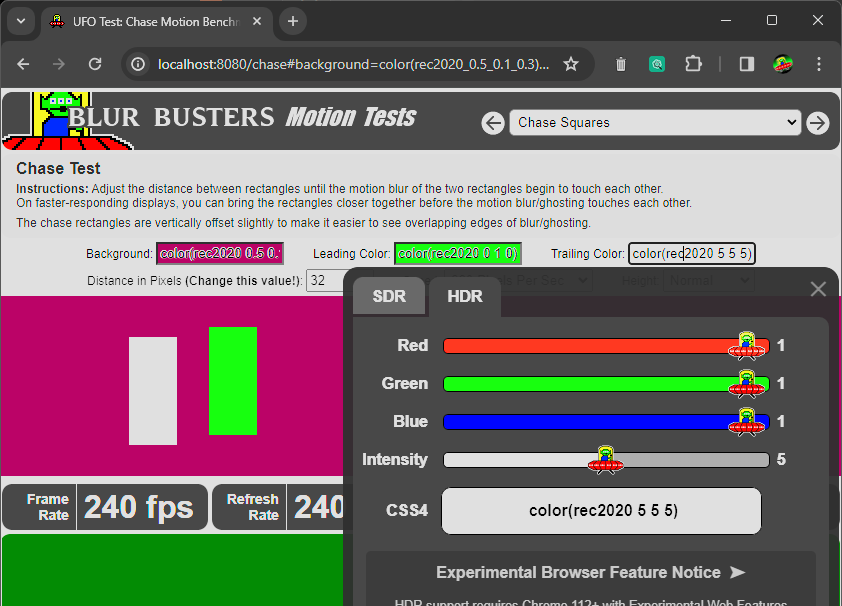
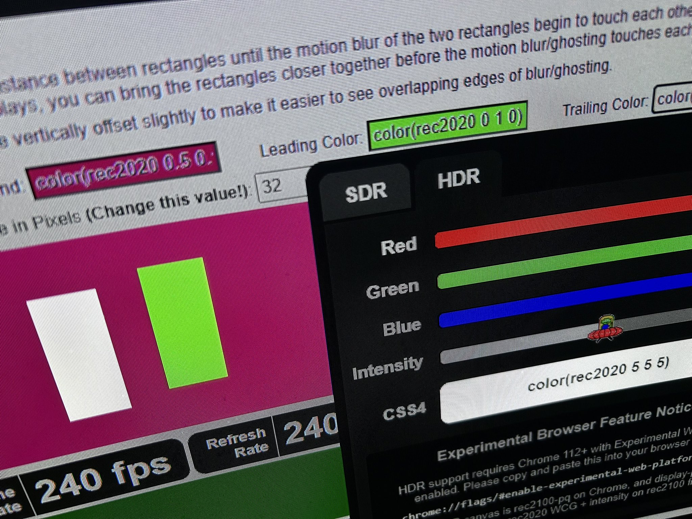

# Test UFO 2.0 HDR

## GitHub [Issue Tracker](https://github.com/blurbusters/testufo-public/issues) for TestUFO

*For the next-generation TestUFO Display Motion Tests created by Mark Rejhon of Blur Busters.*

- Public TestUFO bug reports
- New TestUFO feature requests

## Status

- Current Status: Private Beta
- Detail: TestUFO 2.0 HDR is not yet published to www.testufo.com

Once public, please use the Issues tab to submit bug reports. This is a placeholder for the upcoming brand new TestUFO 2.0 HDR issue tracker for public bug reports.  

## Sneak Preview Pre-Announcement

Blur Busters is about to make a public announcement in December, before Christmas, on time for CES 2024.  But for a sneak preview, here are the preview pre-announcements:

- AVSFORUM: [Some great news for OLED nerds](https://www.avsforum.com/threads/oled-tvs-technology-advancements-thread.681125/page-1058#post-62984052)
- Twitter: [TestUFO 2.0 HDR sneak preview screenshot](https://twitter.com/BlurBusters/status/1730056458899763605)

## Screenshot of TestUFO 2.0 HDR Color Picker

## Photo of Brighter Than Hex #FFFFFF White!

Please note, we were forced to use rec2020 CSS4 with rec2100-pq CANVAs, to achieve this. There was no other way.
