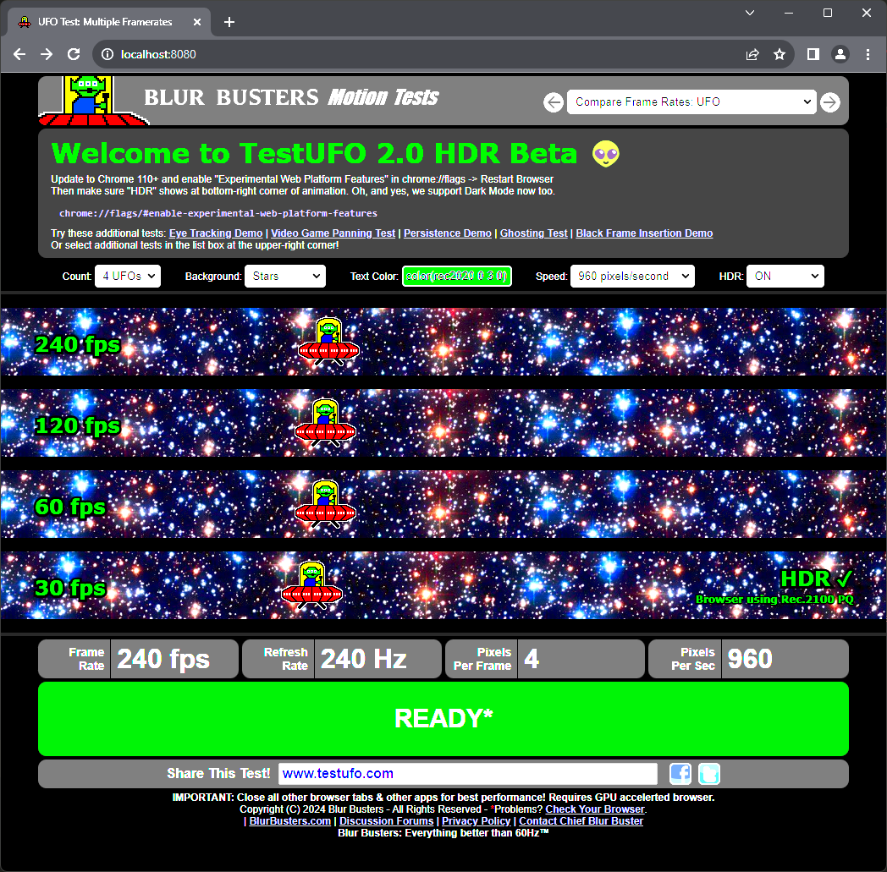
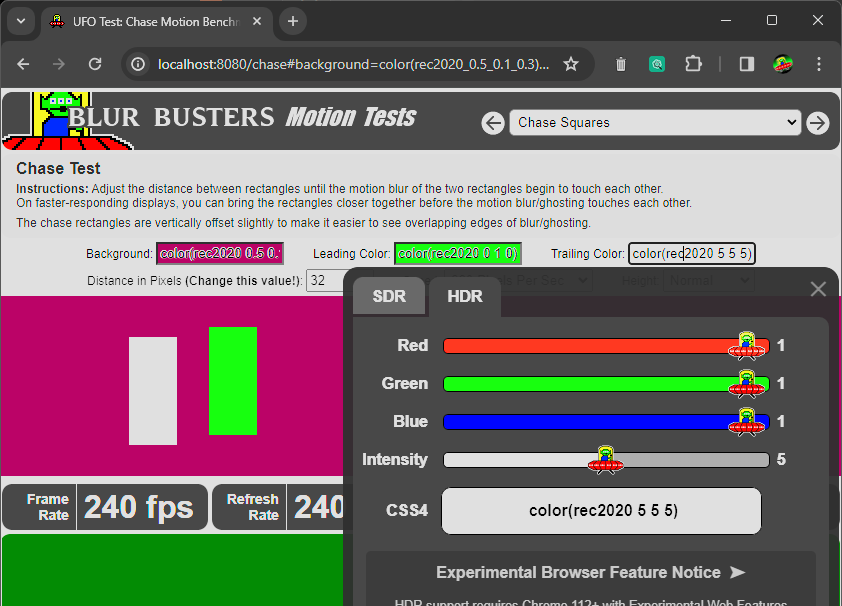
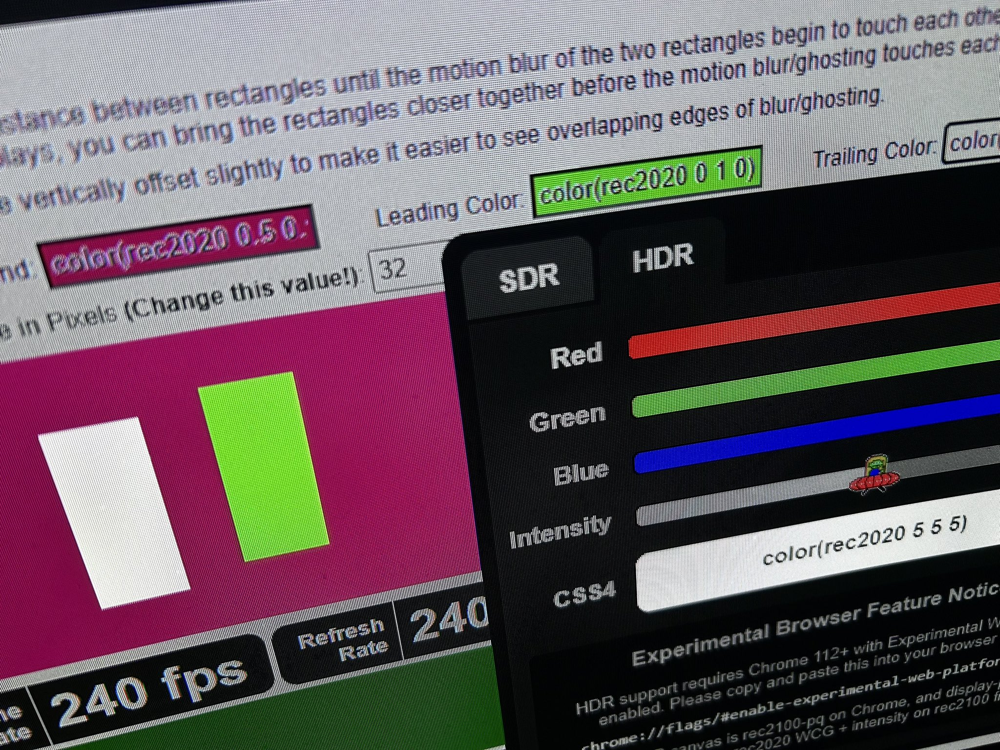
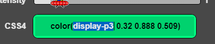

# Test UFO 2.1 - [beta.testufo.com](https://www.testufo.com)

## GitHub [Issue Tracker](https://github.com/blurbusters/testufo-public/issues) for TestUFO

IMPORTANT:

- Stuck at 30Hz or 60Hz? Please [see solutions](https://forums.blurbusters.com/viewtopic.php?f=19&t=3549)
- Bugs? Problems? Feature Requests? Submit a new issue only after reading this. Thank you!

*For the next-generation TestUFO Display Motion Tests created by Mark Rejhon of Blur Busters.*

- Public TestUFO bug reports
- New TestUFO feature requests

## Status

- TestUFO 1.0 running at [old.testufo.com](https://old.testufo.com) (old browser compatible)
- TestUFO 2.1 running at [www.testufo.com](https://www.testufo.com) (modernized HDR engine)

Use this [Issues Tracker](https://github.com/blurbusters/testufo-public/issues) to submit feature requests and bug reports.

## Historical

Past TestUFO 2.0 announcements

- AVSFORUM: [Some great news for OLED nerds](https://www.avsforum.com/threads/oled-tvs-technology-advancements-thread.681125/page-1058#post-62984052)
- Twitter: [TestUFO 2.0 HDR sneak preview screenshot](https://twitter.com/BlurBusters/status/1730056458899763605)

## TestUFO 2.0 HDR Color Picker

## Photo of Brighter Than Hex #FFFFFF White!

Please note, we were forced to use rec2020 CSS4 with rec2100-pq CANVAs, to achieve this. There was no other way.

Also, Safari supports DCI-P3 and we got brighter-than-white capability working (video workaround technique), although [Safari is limited to 120Hz](https://bugs.webkit.org/show_bug.cgi?id=173434) (WebKit Tracker) even if you connect 144Hz+ to MacOS.

Public Discussions? See [TestUFO Discussion Forum](https://forums.blurbusters.com/viewforum.php?f=19)

Bugs? Problems? Please [submit](https://github.com/blurbusters/testufo-public/issues/new/choose) a new issue.
